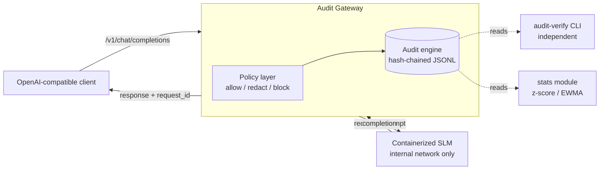

# Architecture — AIHOOTS E1 Audit Gateway

## The problem in one paragraph

Every AI regulation that matters (EU AI Act record-keeping, NIST AI RMF's
`MEASURE`/`MANAGE` functions, most central-bank AI guidance) implies the same
capability: prove, after the fact, what an AI system was asked, what it answered,
and what controls acted on the interaction. Ordinary application logs can't be
that proof — whoever runs the system can silently edit them. This gateway closes
that gap with an audit trail that makes undetected tampering infeasible.

## System overview

## Request lifecycle

1. **Ingress.** A client calls `/v1/chat/completions` exactly as it would call any
   OpenAI-compatible endpoint. No client changes required — the gateway is the only
   path to the model, so governance can't be bypassed.
2. **Policy decision.** The prompt is evaluated: oversized or injection-pattern
   prompts are **blocked** (403); PII is **redacted**; everything else is **allowed**.
   The decision — whatever it is — is written to the audit log as its own event.
3. **Forward.** For allowed/redacted requests, the (possibly redacted) prompt is sent
   to the containerized SLM over an internal-only network.
4. **Audit response.** The response is recorded with digests of prompt and response,
   token counts, and latency. A blocked request produces no response event — the
   absence is itself evidence.
5. **Correlate.** The response carries an `aihoots_request_id` linking it to its
   audit records.

## The audit engine (the core)

Records are newline-delimited JSON, append-only. Each record stores the SHA-256
digest of the previous record — a **hash chain**. Altering any historical record
changes its hash, which breaks every link after it. An independent verifier walks
the file and reports the first broken record.

Two deliberate choices, both documented as ADRs:
- **Digests, not payloads, in the chain.** Keeps the audit record small and avoids
  copying sensitive prompt/response text into a second place. Full payloads, if
  needed, live in a separate access-controlled store.
- **Hash chain, not a ledger or signatures (for E1).** We need tamper-*evidence* for
  a single writer, not distributed consensus or authorship proof. Signing and WORM
  storage are documented upgrade paths, not E1 scope.

## What this does NOT claim (honest limits)

- A hash chain proves **internal consistency**, not **authorship** (that needs signing)
  and not **availability** (an operator could delete the whole file — mitigated in
  production by append-only storage plus off-box replication).
- The policy rules are deliberately simple; their precision/recall is **measured and
  published**, misses included, rather than asserted.

Full decision records: `docs/ADR-001`..`ADR-004`.
